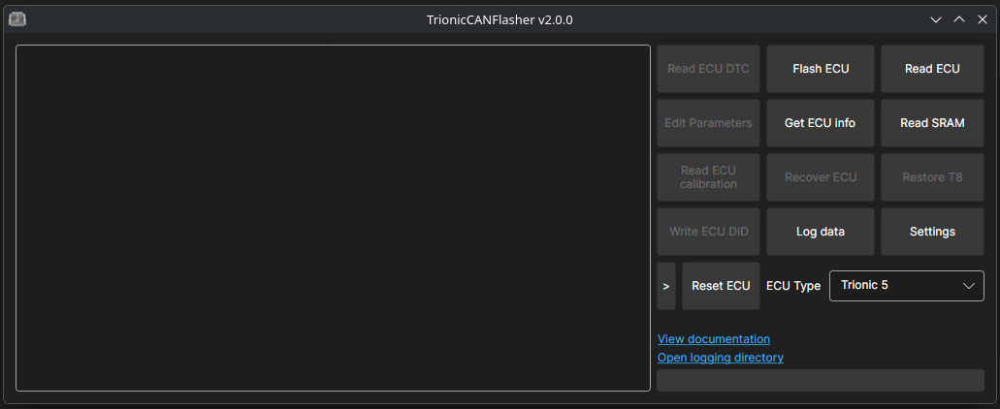

The Trionic CAN Flasher is an Open Source tool used to read and write software in Trionic5, Trionic 7 and Trionic 8 based ECU’s. It can also read software out of Motronic 9.6 based ECU’s and write calibration.

The tool can also be used to modify parameters in the ECU, such as SAI, Convertible and High Output.

The Trionic CAN Flasher runs on Windows, Linux and macOS and supports the following interfaces:

| Interface | Windows | Linux | macOS |
|---|---|---|---|
| Lawicel CANUSB | Lawicel CANUSB DLL driver | FTDI serial port (`/dev/ttyUSB*`) | FTDI serial port (`/dev/cu.usbserial-LW*`) |
| CombiAdapter | libusb (WinUSB driver) | libusb + udev rule | libusb |
| OBDLink SX / ELM327 (not for ME9.6) | serial port | serial port | serial port |
| Just4Trionic | serial port | serial port | serial port |
| SLCAN | serial port | serial port | serial port |
| Kvaser HS | Kvaser CANlib driver | Kvaser linuxcan | not supported |
| J2534 (Beta) | vendor DLL (32-bit, from the registry) | vendor `.so` from `~/.passthru/*.json` | not supported |

## System Requirements
- Windows 10 or Windows 11. Nothing else to install: the setup brings its own .NET runtime and the Visual C++ 2010 runtime the Lawicel driver needs. <strong>Windows 7, 8.1, XP and Vista are NOT supported anymore.</strong>
- Linux x64 or arm64 with a desktop (X11 or XWayland). A normal desktop install already has the libraries it needs (ICU, OpenSSL, fontconfig).
- macOS on Apple silicon or Intel.

The adapters still need their own drivers, see [Adapter setup](#adapter-setup).

## Installation

### Windows
Download TrionicCANFlasher.zip (or TrionicCANFlasher.msi) from releases, extract TrionicCANFlasher.msi and run it. Running the setup of a newer build (also a nightly) over an existing installation upgrades it.

### Linux
Download TrionicCANFlasher-linux-x64.tar.gz (or -linux-arm64) from releases and run it from where you extracted it:

    tar xzf TrionicCANFlasher-linux-x64.tar.gz
    ./TrionicCANFlasher/TrionicCANFlasher

### macOS
Download TrionicCANFlasher-osx-arm64.zip (Apple silicon) or -osx-x64 (Intel) from releases. The build is not signed, so clear the quarantine flag after extracting it, then start it from Terminal or by double-clicking TrionicCANFlasher in Finder:

    unzip TrionicCANFlasher-osx-arm64.zip
    xattr -dr com.apple.quarantine TrionicCANFlasher
    ./TrionicCANFlasher/TrionicCANFlasher

## Adapter setup

### Windows
- Lawicel CANUSB: install the Lawicel CANUSB driver (it provides canusbdrv.dll).
- CombiAdapter: uses the same WinUSB driver as before (from the CombiAdapter driver package; with firmware 2.1 Windows installs it by itself). The setup ships libusb-1.0.dll (LGPL-2.1, [libusb.info](https://libusb.info)).
- Serial adapters (OBDLink SX, ELM327, Just4Trionic, SLCAN): install the vendor driver if Windows does not, and set the latency, see the quick start guide.
- Kvaser: install the Kvaser CANlib drivers.
- J2534: install the vendor's 32-bit J2534 driver, it registers itself in the registry.

### Linux
- Serial adapters (Lawicel CANUSB, OBDLink SX, ELM327, Just4Trionic, SLCAN) use the kernel's serial drivers. Your user needs to be in the group that owns the ports, `dialout` on Debian, Ubuntu and Fedora, `uucp` on Arch: `sudo usermod -aG dialout $USER`, then log out and in again. The flasher sets the FTDI latency to 1 ms by itself. If ModemManager is installed it may probe `/dev/ttyACM*` devices like the Just4Trionic for a few seconds after plug-in.
- CombiAdapter: install libusb from your distribution (`libusb-1.0-0` on Debian/Ubuntu, `libusb1` on Fedora, `libusb` on Arch) and the udev rule that ships next to the program, so the logged-in user can open the adapter:

      sudo cp TrionicCANFlasher/70-trioniccanflasher.rules /etc/udev/rules.d/
      sudo udevadm control --reload && sudo udevadm trigger

  Unplug and replug the adapter afterwards.
- Kvaser: install Kvaser's linuxcan driver package from kvaser.com (kernel drivers and libcanlib.so.1).
- J2534: there is no registry on Linux. Each driver is described by a json file in `~/.passthru/`, for example `~/.passthru/openport2.json`, and the flasher lists every file whose library exists (a leading `~/` is your home directory):

      {
        "NAME": "OpenPort 2.0",
        "VENDOR": "Tactrix Inc.",
        "FUNCTION_LIB": "~/.passthru/libj2534_openport2.so",
        "CAN": true,
        "ISO15765": true
      }

### macOS
- Serial adapters use macOS's built-in FTDI and USB serial drivers and show up as `/dev/cu.*`. The Lawicel CANUSB uses its own FTDI product id; if no `/dev/cu.usbserial-LW…` device appears when it is plugged in, install [FTDI's VCP driver](https://ftdichip.com/drivers/vcp-drivers/).
- CombiAdapter: install libusb with [Homebrew](https://brew.sh): `brew install libusb`.
- Kvaser and J2534 are not available on macOS.

## Disclaimer
This is Open Source software tools that pokes around in your car's control system. The authors of the tools shall not be held accountable for how you decide to use the tools. If you are not careful, you can easily brick your car with these tools so please use this software with care.

# Documentation
Is included in the setup file, and also available here:
<a href=https://github.com/roffe/Trionic/blob/master/TrionicCANFlasher/TrionicCanFlasher.pdf>Pdf</a>

# Quick start guide
This is a quick guide to help you get started with the Trionic CAN Flasher.

The first step is to download the latest version of the Trionic CAN Flasher and install it, see [Installation](#installation). On Windows, run the TrionicCANFlasher.msi to install Trionic CAN Flasher.

The next step is to install the device you use to connect your computer to your car. There are multiple options, but this guide will focus on the OBDLink SX based alternative. It's not the best, but the usually the cheapest. <a href="http://www.obdlink.com/sxusb/">ODBLink SX USB</a>. Please note that the Trionic CAN Flasher does not work with Bluetooth or WiFi devices, but requires a cable connection.

When you have connected the device to your PC's and drivers has been installed, it's important to set the latency to 1-2ms.

On Windows, start the device manager, find the serial port (e.g. COM7) under Ports. Right click and select settings. Select tab port settings and click Advanced... button. Here you find latency. Set it to 2 ms. On Linux the flasher does this by itself.

Now you can start the Trionic CAN Flasher. 
Next is to select your ECU type in main screen.
Click on Settings and select Adapter type, Adapter and COM speed. In this example we select Trionic 8, OBDLink SX, COM7 (`/dev/ttyUSB0` on Linux, `/dev/cu.usbserial-…` on macOS) and set Com speed to 2Mbit.

If your cable is also connected to your car's ODB port, you should now have contact. Put your key in Off position and it is highly recommended to have an external charger connected and that you do not touch anything during this process. We want to minimize signaling on the bus, which may disturb the process.

Try now by pressing <strong>Get ECU Info</strong>. You should now see logs that indicate that the ECU is being read.

If all this went well, it's time to read the software.

The process is:
<ol>
	<li>Have your key in On position</li>
	<li>Initiate action (Read ECU / Write ECU)</li>
	<li>When you see message <em>Starting bootloader</em> then you turn key to Off position</li>
</ol>
When you have clicked <strong>Read ECU</strong>, select a filename and watch the log window. This should take around 10 minutes and the result is that you have downloaded you software.

Next is to take it to T8Suite, do your changes and write it back to the car. Which is done by clicking <strong>Flash ECU</strong>. 
Before writing the flash its recommended to use a 12V battery charger.

If something goes wrong during flashing, don't panic. Just try to <strong>Recover ECU</strong> and re-install your original software. You might have to shut down and disconnect everything, but it is not likely anything is broken. Only that you do not have any software in your ECU.

# Building from source
You need the [.NET 10 SDK](https://dotnet.microsoft.com/download/dotnet/10.0).

    git clone https://github.com/roffe/Trionic
    cd Trionic
    dotnet test TrionicCANLibTest
    dotnet run --project TrionicCANFlasher

A self-contained build that runs on a machine without .NET, for `win-x86`, `linux-x64`, `linux-arm64`, `osx-arm64` or `osx-x64`:

    dotnet publish TrionicCANFlasher/TrionicCANFlasher.csproj -c Release -r linux-x64 --self-contained -o out/TrionicCANFlasher

The Windows build is 32-bit (`win-x86`) because most J2534 drivers and the Lawicel CANUSB driver only come as 32-bit DLLs, so on Windows `dotnet run` needs the x86 .NET 10 runtime installed.

The Windows setup is built with WiX 6 (restored from NuGet) on Windows, from a `win-x86` publish folder with libusb-1.0.dll added to it (`MinGW32/dll/libusb-1.0.dll` from the [libusb release](https://github.com/libusb/libusb/releases)):

    dotnet build SetupCANFlasher/SetupCANFlasher.wixproj -c Release -p:PublishDir=C:\path\to\out\TrionicCANFlasher

The release builds are made by [.github/workflows/build.yml](.github/workflows/build.yml): every push to master updates the `nightly` pre-release, a `v*` tag makes a release.

## Versioning and releasing
No file holds the version. Every build takes it from the nearest `vX.Y.Z` git tag ([Directory.Build.props](Directory.Build.props)), and the window title shows it:

| Build | Version |
|---|---|
| A tagged commit, for example `v0.1.75` | `0.1.75` |
| Commits after the tag (nightlies, local builds) | `0.1.75-<first 9 characters of the commit sha>` |
| Local build with uncommitted changes | `0.1.75-<sha>-dirty` |
| A tag with a label, for example `v0.1.76-beta` | `0.1.76-beta`, after it `0.1.76-beta-<sha>` |
| No git, no tag or a shallow clone | `0.0.0-<sha>`, with a build warning |

The file and assembly version, which the update check and the MSI use, is the tag's numbers padded to four parts (`0.1.75.0`, `0.1.76.0` for `v0.1.76-beta`). A nightly keeps its tag's number, so running its setup again reinstalls over the same version.

To make a release, tag the commit and push the tag:

    git tag v0.1.75
    git push origin v0.1.75

To build without git, for example from a source archive, pass the version: `dotnet build -p:Version=0.1.75`.
